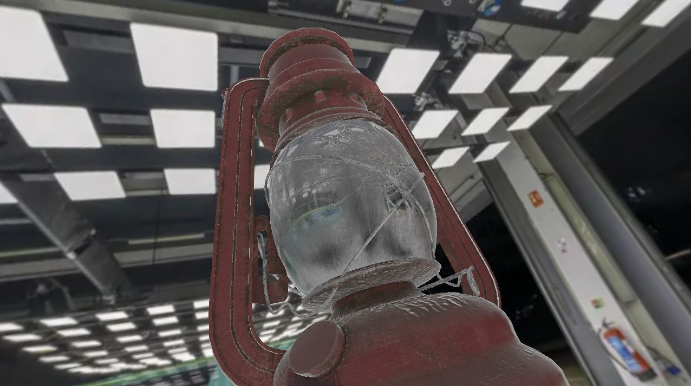

# pbrv

`pbrv` (PBR Viewer) is a lightweight CLI program to load inspect 3D PBR assets. 

## Usage

`python pbrv.py [--albedo VALUE_OR_PATH] [--normal PATH] [--roughness VALUE_OR_PATH] [--metalness VALUE_OR_PATH] [--ambient-occlusion PATH] [-ssao] [--envmap PATH] mesh_path `

## Features/Specs
- Interactive window
    - Trackball camera (with path indepedance)
    - Left click to rotate
    - Right click to pan
    - Double click to focus
- Deffered Shading
- Metal/roughness workflow
- Normal mapping (tangent space)
- SSAO (if no AO map)
- Image based lighting
    - Cubemaps
    - Equirectangular panoramas (converted to cubemap)
    - Cubemap prefiltering
        - Irradiance (Cosine)
        - Specular (GGX)