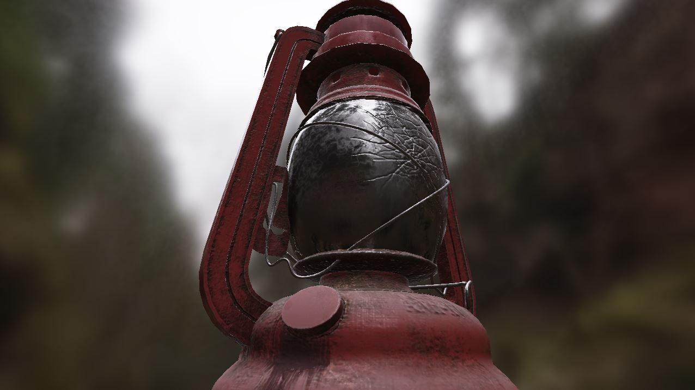
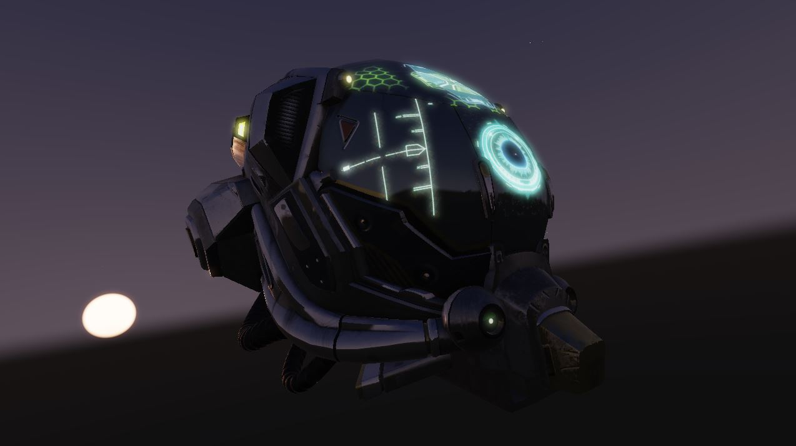
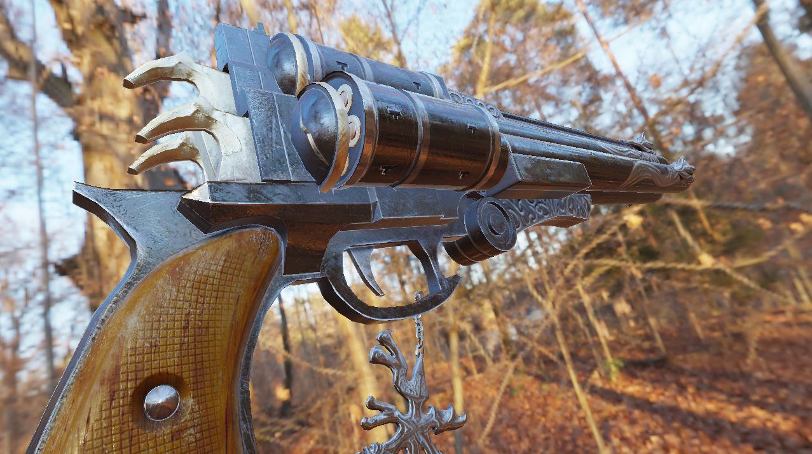
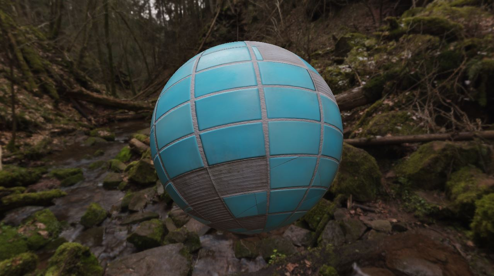

# pbrv

`pbrv` (PBR Viewer) is a small Python PBR viewer in CLI.

[]()

## Quick run

```
python -m pip install dependencies.txt
python -m pbrv.main ...
```


## Installation

```
python -m pip install -e .
```

## Usage

```
pbrv [mesh_path ...] [--albedo VALUE_OR_PATH] [--normal PATH] [--roughness VALUE_OR_PATH] [--metallic VALUE_OR_PATH] [--ambient-occlusion PATH] [--emissive VALUE_OR_PATH] [--specular VALUE_OR_PATH] [--specular-tint SPECULAR_TINT] [-ssao] [--env VALUE_OR_PATH] [--directional-light-radiance VALUE] [--directional-light-direction VALUE] [--point-light-radiance VALUE] [--point-light-position VALUE] [-auto-sun] [--bloom] [--tone-mapping {simple,aces,reinhard,uncharted2,none}] [--exposure EXPOSURE] [--renderer RENDERER]
```


The window is a [moderngl window](https://github.com/moderngl/moderngl-window) so you can also use its arguments. For instance, set GLFW backend by adding `--window glfw`.

## Features/Specs
- Interactive window
    - Trackball camera (with path indepedance)
    - Lclick: rotate
    - Rclick: pan
    - Dblclick: focus
    - Ctrl+Lclick: rotate object
    - Shift+Lclick: rotate environment
    - Alt+Lclick: rotate directional light
- Deferred Shading

- Metal/roughness workflow
- Normal mapping (tangent space)
- SSAO (if no AO map)
- Image based lighting
    - Cubemaps
    - Equirectangular panoramas (converted to cubemap)
    - Cubemap prefiltering
        - Irradiance (Cosine)
        - Specular (GGX)
- 1 Directional light
- 1 Point light
- Procedural Environment
    - Sun (sunrise/dusk)
    - Based on directional light direction
    - Stars at night

## Dependencies
- moderngl
- moderngl-window
- trimesh
- numpy
- pyrr
- opencv-python

## Examples
[]()
[]()
[]()
[]()